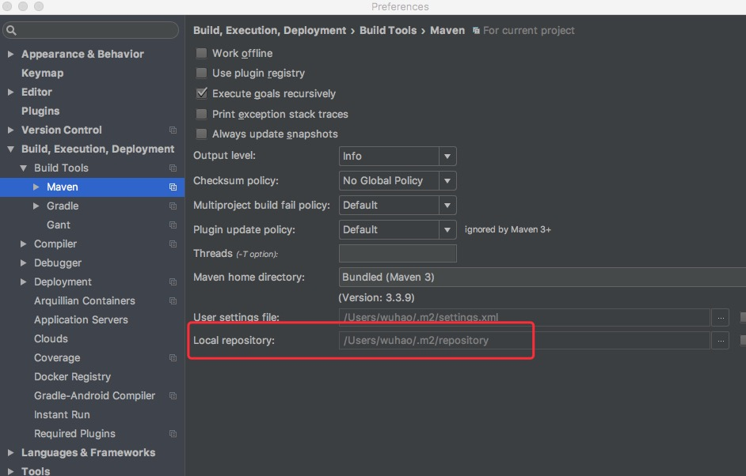

---
[](download/1.0.2.zip)
## 安装
克隆项目到本地，`Idea-->MavenProjects-->parsec-plugin-->Lifecycle-->install`。  
第一次安装会比较缓慢，可以直接下载打包好的插件然后拷贝到本地maven仓库`com/parsec`目录下。  
本地maven仓库位置:
  

## 插件列表
* project-generate 基于[universal](http://gitlab.parsec.com.cn/zhangpj/universal)建立spring boot项目。会更新`pom.xml`，添加文件：`application.properties`,`logback.xml`,`generatorConfig.xml`,`Application.java`
* code-generate 在[mybatis-generator](https://github.com/mybatis/generator/)基础上，可以生成controller和service
* deploy 部署jar包到远程服务器
* ops-helper 可实时查看远程服务器日志，启动、停止和重启远程服务


## 插件的使用
### project-generate
1.建立空maven项目  
2.在`pom.xml`添加插件
```xml
<build>
    <plugins>
        <plugin>
            <groupId>com.parsec</groupId>
            <artifactId>parsec-plugins</artifactId>
            <version>1.0.3</version>
            <configuration>
                <verbose>true</verbose>
                <overwrite>true</overwrite>
                <!--代码生成需要的配置文件，默认src/main/resources/generatorConfig.xml-->
                <configurationFile>src/main/resources/generatorConfig.xml</configurationFile>
                <!--要部署的服务器地址,deploy和ops-helper插件使用必填-->
                <host>root@192.168.0.100</host>
                <!--工作目录,deploy和ops-helper插件使用必填-->
                <serverPath>/mnt/springboot/yourServerPath</serverPath>
            </configuration>
            <!--代码生成需要加入数据库链接的依赖-->
            <dependencies>
                <dependency>
                    <groupId>mysql</groupId>
                    <artifactId>mysql-connector-java</artifactId>
                    <version>5.1.36</version>
                </dependency>
            </dependencies>
        </plugin>
    </plugins>
</build>
```
3.执行 ```Plugins-->parsecs-->parsec:project-generate```

### code-generate
1. 配置好`generatorConfig.xml`。
2. code-generate。 

### deploy 
1. 确保host和serverPath正确。如果已经设置ssh免密登录，跳过2。
2. 将你的ssh公钥（`cat ~/.ssh/id_ras.pub`）写入到目标服务器`/root/.ssh／authorized_keys`。
3. 先将服务打包：mvn package
4. 运行deploy，如果服务器serverPath不存在，会新建目录，然后继续上传jar包。  
 
### ops-helper
参考deploy插件使用的前两条。
运行后有四个命令：log,start,stop,restart。
* log:使用`log logpath/logfile`获取指定日志文件的实时输出。如果不指定日志文件，则获取工作目录（serverPath）下`nohup.out`的输出。
* start:启动远程服务。
* stop:停止远程服务。
* restart:重启远程服务。  

## 参考  
*  [generate ssh key](http://gitlab.parsec.com.cn/help/ssh/README)


